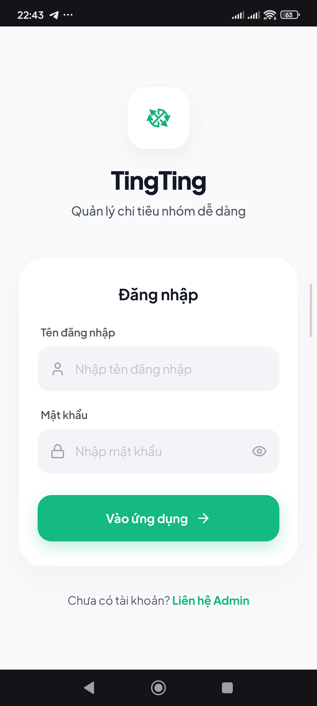
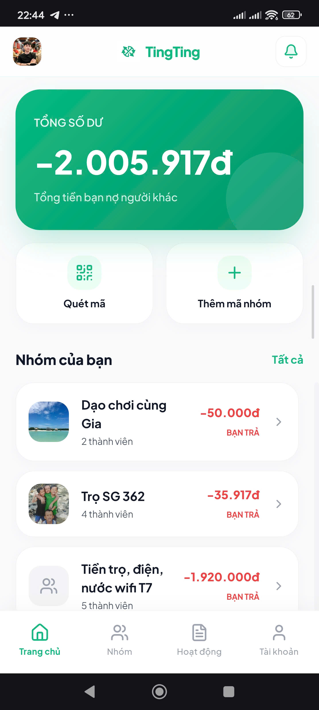
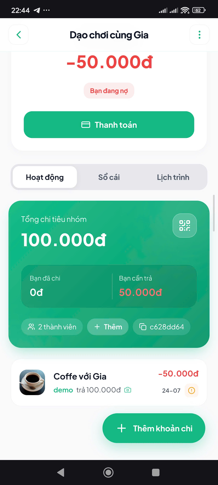
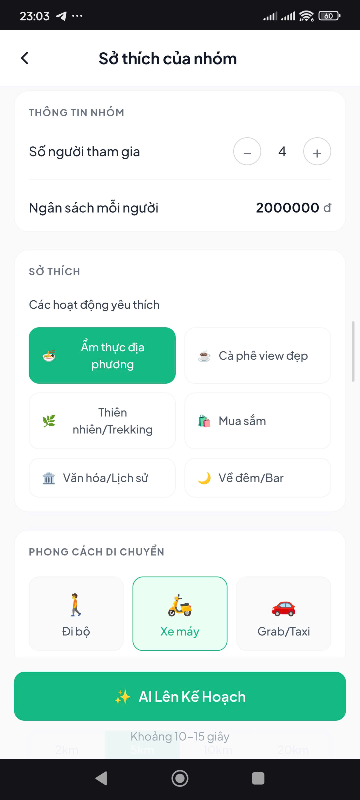
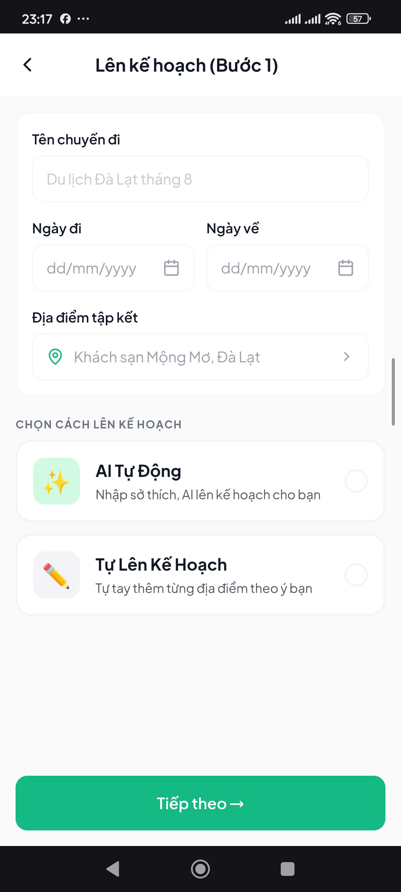
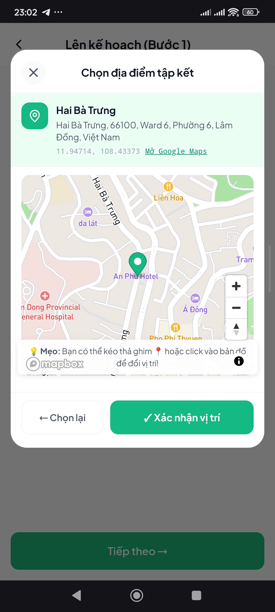
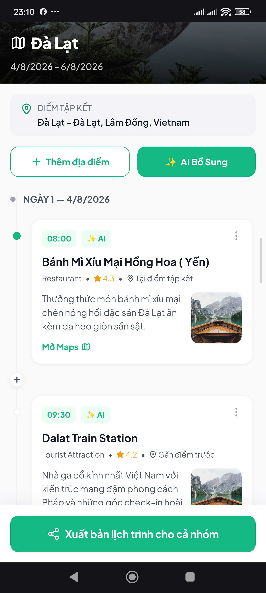
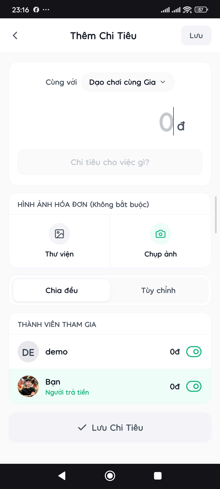
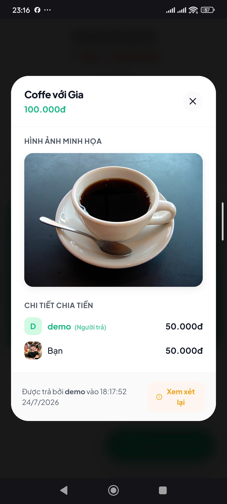

# 🌍 TingTing - Nền Tảng Quản Lý Nhóm & Lên Lịch Trình Bằng AI


**TingTing** là một nền tảng quản lý tài chính nhóm và lên kế hoạch du lịch thông minh, giúp người dùng dễ dàng tổ chức các chuyến đi, chia sẻ chi phí minh bạch và tự động hóa việc sắp xếp lịch trình thông qua sự hỗ trợ của **Google Gemini AI**.

Dự án được xây dựng với mục tiêu mang lại trải nghiệm mượt mà, tối ưu hiệu suất và kiến trúc có khả năng mở rộng tốt.

---

## 📸 Trải Nghiệm Người Dùng (UI/UX)

Dưới đây là luồng nghiệp vụ thực tế của ứng dụng, được thiết kế theo phong cách hiện đại, tối giản và thân thiện với người dùng:

### 1. Đăng Nhập & Tổng Quan
| Đăng Nhập / Đăng Ký | Màn Hình Trang Chủ (Dashboard) |
|:---:|:---:|
|  |  |
| *Hệ thống xác thực bảo mật với JWT, mã hóa mật khẩu bằng Bcrypt.* | *Dashboard quản lý các nhóm đang tham gia, hiển thị số dư quỹ nhóm trực quan.* |

### 2. Quản Lý Nhóm & Thành Viên
| Chi Tiết Nhóm | Cài Đặt Cá Nhân |
|:---:|:---:|
|  |  |
| *Hiển thị các hoạt động của nhóm, thành viên và tình trạng quỹ.* | *Quản lý thông tin, avatar (Upload qua AWS S3) và tài khoản ngân hàng.* |

### 3. Lên Lịch Trình Bằng AI & Bản Đồ Tương Tác
| Khảo Sát Sở Thích AI | Cấu Hình Lịch Trình |
|:---:|:---:|
|  |  |
| *Thu thập dữ liệu cá nhân hóa (Ngân sách, phong cách, phương tiện) để cấp cho AI.* | *Lựa chọn chế độ tạo thủ công hoặc tự động qua Google Gemini 3.5 Flash.* |

| Tìm Kiếm Bản Đồ (Mapbox) | Lịch Trình Hoàn Thiện |
|:---:|:---:|
|  |  |
| *Tích hợp Mapbox GL & Foursquare API để tìm kiếm và định vị chính xác điểm đến.* | *AI trả về lộ trình thông minh, tự động tính toán khoảng cách qua tọa độ không gian.* |

### 4. Quản Lý Chi Tiêu & Chia Tiền Nhóm
| Thêm Khoản Chi | Chi Tiết Khoản Chi |
|:---:|:---:|
|  |  |
| *Tạo khoản chi với hóa đơn đính kèm (Lưu trữ S3) và tự động chia đều.* | *Minh bạch dòng tiền, ai đã trả, ai còn nợ, kèm theo QR Code thanh toán chuẩn NAPAS.* |

---

## 🛠 Công Nghệ Sử Dụng (Tech Stack)

### 🔹 Frontend
- **Framework:** React 18, Vite
- **Ngôn ngữ:** TypeScript
- **Styling:** CSS3 thuần (Xây dựng hệ thống biến màu sắc `index.css`, không lạm dụng Framework, tối ưu hóa CSS DOM).
- **State Management:** React Context API & React Hooks.
- **Bản đồ & Geocoding:** Mapbox GL JS, Foursquare Places API.
- **Routing:** React Router v6.
- **Khác:** Axios, Lucide React (Icons), QR Code React.

### 🔹 Backend
- **Core:** Node.js, Express.js
- **Ngôn ngữ:** TypeScript
- **Cơ sở dữ liệu:** PostgreSQL
- **ORM:** Prisma
- **AI Integration:** Google Gemini SDK (`@google/genai`) xử lý luồng prompt logic phức tạp.
- **Bảo mật:** JWT (JSON Web Tokens), Bcrypt, Helmet, Rate Limit.
- **Upload File:** Multer, AWS SDK (S3 / Cloudflare R2).

---

## 🏗 Kiến Trúc & Tối Ưu Hiệu Suất (Architecture & Optimization)

Dự án được thiết kế theo mô hình **Client-Server** với kiến trúc phân tầng (Controller-Service-Repository qua Prisma) giúp hệ thống dễ bảo trì và có khả năng mở rộng.

### ⚡ Tối ưu Frontend
- **Debounce Search:** Các input tìm kiếm (đặc biệt là Mapbox Geocoding) được bọc qua Custom Hook `useDebounce` với delay 500ms để giảm thiểu lượng API calls thừa lên hệ thống Mapbox, tiết kiệm chi phí Request.
- **Error Boundaries:** Xử lý triệt để các lỗi Crash Component (VD: Mapbox thiếu Token) bằng kiến trúc ErrorBoundary (bắt lỗi Runtime), đảm bảo ứng dụng không bao giờ bị "Trắng màn hình" (White screen of death) khi người dùng trải nghiệm.
- **Phân tách trạng thái (State Separation):** Các thao tác UI nặng không làm Re-render toàn bộ DOM Tree.
- **Responsive Design:** Thiết kế chuẩn Mobile-First đảm bảo tương thích hoàn hảo trên các thiết bị di động.

### ⚡ Tối ưu Backend & Cơ Sở Dữ Liệu
- **Xử lý AI Fallback & Retry:** Gemini API thường xuyên gặp tình trạng "High Demand" (Status 503). Hệ thống Backend được thiết kế vòng lặp Retry tự động (Exponential Backoff), và tự động kích hoạt **Mock Data Fallback** nếu AI quá tải hoàn toàn, đảm bảo User Flow tạo lịch trình không bao giờ bị gián đoạn.
- **Streaming & Async Processing:** Tách biệt luồng xử lý AI tốn thời gian ra khỏi Main Event Loop của Express.
- **Security & DDoS Protection:** Chống Bruteforce bằng `express-rate-limit`, làm sạch dữ liệu đầu vào.
- **Giao dịch an toàn (ACID):** Các logic nhạy cảm liên quan tới tiền bạc (Tạo chi tiêu, cập nhật số dư thành viên, tạo nhóm) được đóng gói chặt chẽ trong `prisma.$transaction` để đảm bảo tính toàn vẹn dữ liệu, tránh sai lệch tài chính trong các luồng Async.

---

## ☁️ Hạ Tầng & Triển Khai (Infrastructure & Deployment)

Dự án được triển khai toàn diện trên các nền tảng Cloud hiện đại:

- **Frontend Hosting:** Triển khai Frontend Admin và Frontend User trực tiếp trên **Vercel** thông qua CI/CD tự động từ GitHub. Tận dụng Edge Network & CDN toàn cầu của Vercel để tối ưu tốc độ tải trang.
- **Backend Hosting:** Triển khai Web Service API (Node.js) trên **Render**. Tích hợp sẵn PM2/Node runtime tối ưu hóa I/O.
- **Cơ sở dữ liệu:** Sử dụng **Render Managed PostgreSQL** đảm bảo độ trễ thấp (Low Latency) do được đặt cùng Virtual Private Cloud (VPC) với Backend.
- **Lưu Trữ File (Object Storage):** Thay vì lưu ảnh rác vào ổ cứng server, hệ thống tích hợp chuẩn **AWS S3 API** (qua Cloudflare R2 / AWS S3) để lưu trữ hình ảnh tĩnh (Avatar, Hóa đơn giao dịch). Giúp Backend hoàn toàn Stateless.

---

## 🚀 Cài Đặt & Chạy Môi Trường Cục Bộ (Local Setup)

### Yêu cầu tiên quyết
- Node.js (>= 18)
- PostgreSQL đang chạy tại cổng `5433` (Hoặc tùy biến theo URL trong `.env`)
- Git

### 1. Clone dự án
```bash
git clone https://github.com/nguyenquynhgia-79/ting-ting-app.git
cd ting-ting-app
```

### 2. Cài đặt Backend
```bash
npm install
# Tạo file .env và điền các biến cấu hình: DATABASE_URL, JWT_SECRET, VITE_MAPBOX_ACCESS_TOKEN, GEMINI_API_KEY...
npx prisma generate
npx prisma db push
npm run dev
```
*API Server sẽ khởi chạy tại `http://localhost:3000`*

### 3. Cài đặt Frontend
```bash
cd FE
npm install
# Tạo file FE/.env và cấu hình VITE_API_URL, VITE_MAPBOX_ACCESS_TOKEN
npm run dev
```
*Ứng dụng sẽ khởi chạy tại `http://localhost:5173`*

---

## 🙏 Lời Cảm Ơn
Dự án **TingTing** được phát triển với sự tâm huyết nhằm giải quyết một vấn đề cực kỳ thực tế trong cuộc sống hằng ngày: "Sự rườm rà trong việc lên kế hoạch đi chơi và sự tế nhị, nhạy cảm khi chia tiền tập thể". 

Đặc biệt gửi lời cảm ơn đến:
- Đội ngũ phát triển **Mapbox** và **Google Gemini** vì những tài nguyên API quá đỗi mạnh mẽ và mượt mà.
- Cộng đồng phát triển **Mã nguồn mở** (React, Express, Prisma) đã tạo ra nền tảng để xây dựng những sản phẩm vươn tầm.

---
*Developed with ❤️ by Quynh Gia Nguyen.*