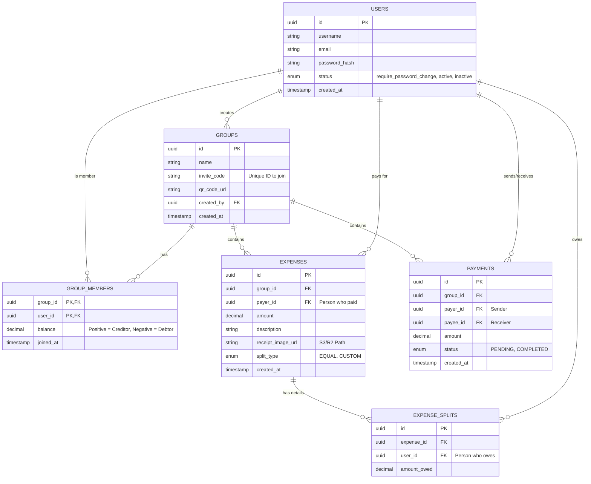

# Nội dung file Markdown thiết kế Database Schema
db_schema_content = """# Tài liệu Thiết kế Cơ sở dữ liệu (Database Schema)

Tài liệu này mô tả cấu trúc các bảng, quan hệ và kiểu dữ liệu cho ứng dụng quản lý chi tiêu nhóm, được tối ưu cho PostgreSQL/MySQL.

## 1. Biểu đồ Quan hệ Thực thể (ER Diagram)



## 2. Chi tiết Cấu trúc Bảng (Table Definitions)

### 2.1. Users (Người dùng)

| Column | Type | Constraints | Description |
| :--- | :--- | :--- | :--- |
| **id** | UUID | PK, NOT NULL | Khóa chính |
| **username** | VARCHAR(50) | UNIQUE, NOT NULL | Tên đăng nhập |
| **email** | VARCHAR(100) | UNIQUE, NOT NULL | Email |
| **password_hash** | VARCHAR(255) | NOT NULL | Hash mật khẩu |
| **status** | ENUM | `require_password_change, active, inactive` | Trạng thái tài khoản |
| **created_at** | TIMESTAMP | DEFAULT NOW() | Ngày tạo |

### 2.2. Groups (Nhóm)

| Column | Type | Constraints | Description |
| :--- | :--- | :--- | :--- |
| **id** | UUID | PK, NOT NULL | Khóa chính |
| **name** | VARCHAR(100) | NOT NULL | Tên nhóm |
| **invite_code** | VARCHAR(20) | UNIQUE, NOT NULL | Mã mời gia nhập (6-8 ký tự) |
| **qr_code_url** | VARCHAR(255) | | Đường dẫn ảnh QR |
| **created_by** | UUID | FK (Users.id) | Người tạo nhóm |
| **created_at** | TIMESTAMP | DEFAULT NOW() | Ngày tạo |

### 2.3. Group_Members (Thành viên nhóm)

**Bảng kết nối (Junction Table)**.

| Column | Type | Constraints | Description |
| :--- | :--- | :--- | :--- |
| **group_id** | UUID | PK, FK (Groups.id) | Khóa nhóm |
| **user_id** | UUID | PK, FK (Users.id) | Khóa người dùng |
| **balance** | DECIMAL(10,2) | DEFAULT 0 | Dư nợ (âm: nợ hệ thống, dương: hệ thống nợ) |
| **joined_at** | TIMESTAMP | DEFAULT NOW() | Ngày tham gia |

### 2.4. Expenses (Khoản chi)

| Column | Type | Constraints | Description |
| :--- | :--- | :--- | :--- |
| **id** | UUID | PK, NOT NULL | Khóa chính |
| **group_id** | UUID | FK (Groups.id) | Nhóm chi |
| **payer_id** | UUID | FK (Users.id) | Người chi trả |
| **amount** | DECIMAL(10,2) | NOT NULL | Tổng số tiền |
| **description** | VARCHAR(255) | | Mô tả khoản chi |
| **receipt_image_url** | VARCHAR(255) | | Đường dẫn ảnh hóa đơn |
| **split_type** | ENUM | `EQUAL, CUSTOM` | Loại chia |
| **created_at** | TIMESTAMP | DEFAULT NOW() | Ngày tạo |

### 2.5. Expense_Splits (Chi tiết chia khoản chi)

| Column | Type | Constraints | Description |
| :--- | :--- | :--- | :--- |
| **id** | UUID | PK, NOT NULL | Khóa chính |
| **expense_id** | UUID | FK (Expenses.id) | Khoản chi liên quan |
| **user_id** | UUID | FK (Users.id) | Người thụ hưởng (nợ tiền) |
| **amount_owed** | DECIMAL(10,2) | NOT NULL | Số tiền nợ |

### 2.6. Payments (Thanh toán/Đối trừ)

| Column | Type | Constraints | Description |
| :--- | :--- | :--- | :--- |
| **id** | UUID | PK, NOT NULL | Khóa chính |
| **group_id** | UUID | FK (Groups.id) | Nhóm |
| **payer_id** | UUID | FK (Users.id) | Người gửi tiền |
| **payee_id** | UUID | FK (Users.id) | Người nhận tiền |
| **amount** | DECIMAL(10,2) | NOT NULL | Số tiền |
| **status** | ENUM | `PENDING, COMPLETED` | Trạng thái thanh toán |
| **created_at** | TIMESTAMP | DEFAULT NOW() | Ngày tạo |

## 3. Ràng buộc và Logic Nghiệp vụ (Constraints & Business Rules)

1.  **Balance Consistency**:
    * Trong bảng `GROUP_MEMBERS`, tổng `balance` của tất cả các thành viên trong cùng một `group_id` phải luôn bằng 0.
    * `SUM(balance) WHERE group_id = X` phải bằng `0`.

2.  **Split Validation**:
    * Khi lưu vào `EXPENSE_SPLITS`, tổng `amount_owed` phải bằng tổng `amount` của `EXPENSES`.
    * `SUM(amount_owed WHERE expense_id = Y) == Expenses.amount`.

3.  **Settlement Logic**:
    * Khi `PAYMENTS.status = 'COMPLETED'`: 
        * `GROUP_MEMBERS.balance` của `payer_id` tăng `amount`.
        * `GROUP_MEMBERS.balance` của `payee_id` giảm `amount`.

4.  **Group Membership Lock**:
    * Không thể thêm một `user_id` đã tồn tại trong `GROUP_MEMBERS` của một `group_id`.
    * Chỉ có thể xóa hoặc rời nhóm khi `GROUP_MEMBERS.balance == 0`.

## 4. Indexes (Chỉ mục tối ưu)

Để đảm bảo hiệu năng truy vấn cao:

```sql
-- Index cho việc tính toán Balance nhanh
CREATE INDEX idx_group_members_balance ON group_members(group_id, balance);

-- Index cho việc truy xuất các khoản chi
CREATE INDEX idx_expenses_group ON expenses(group_id);
CREATE INDEX idx_expenses_payer ON expenses(payer_id);

-- Index cho việc truy xuất các khoản nợ
CREATE INDEX idx_splits_user ON expense_splits(user_id);
CREATE INDEX idx_splits_expense ON expense_splits(expense_id);

-- Index cho thanh toán
CREATE INDEX idx_payments_group ON payments(group_id);
CREATE INDEX idx_payments_payer_payee ON payments(payer_id, payee_id);
```

## 5. Data Types (Lựa chọn kiểu dữ liệu)

* **Tiền tệ (Currency)**: Sử dụng `DECIMAL(10,2)` thay vì `FLOAT` để tránh lỗi làm tròn số thập phân trong tính toán tài chính.
* **ID**: Sử dụng `UUID` để đảm bảo tính duy nhất trên toàn hệ thống.
* **Trạng thái**: Sử dụng `ENUM` để giới hạn các giá trị có thể, giúp dữ liệu sạch và dễ quản lý.

---
*Tài liệu này là nền tảng cho việc triển khai cơ sở dữ liệu của ứng dụng quản lý chi tiêu nhóm.*